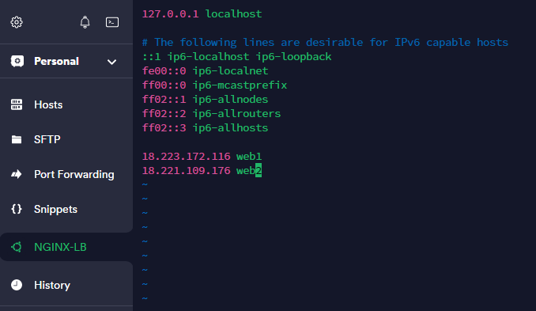
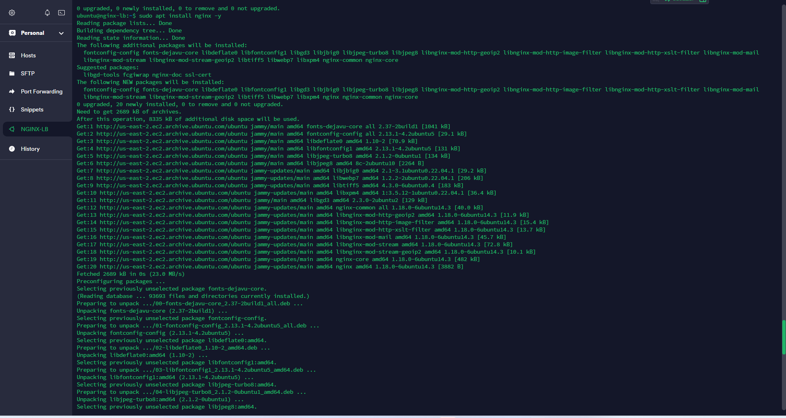
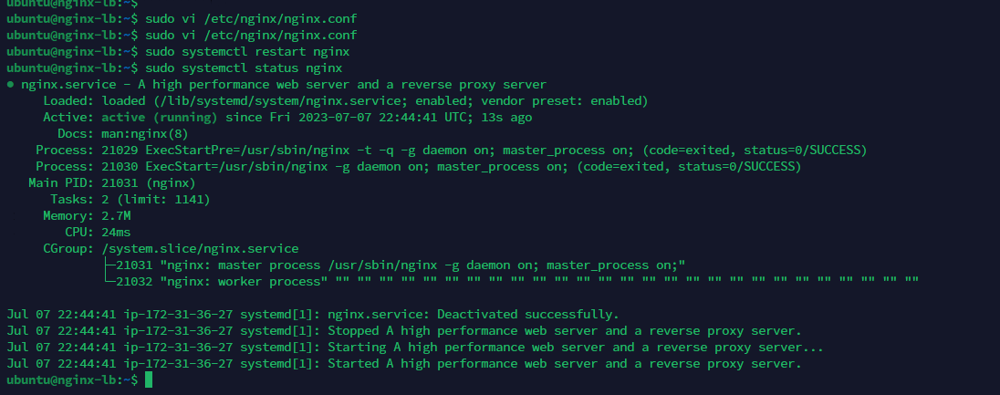
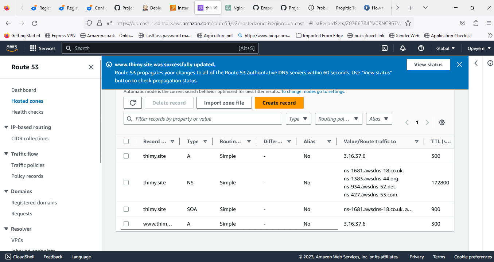
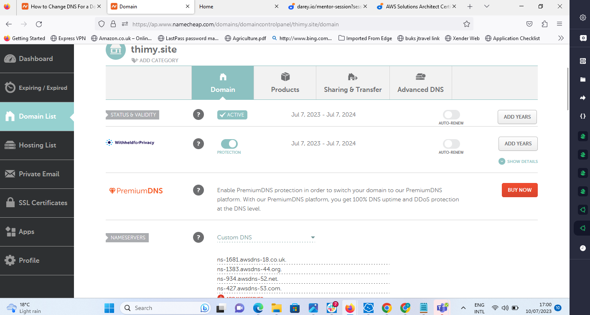
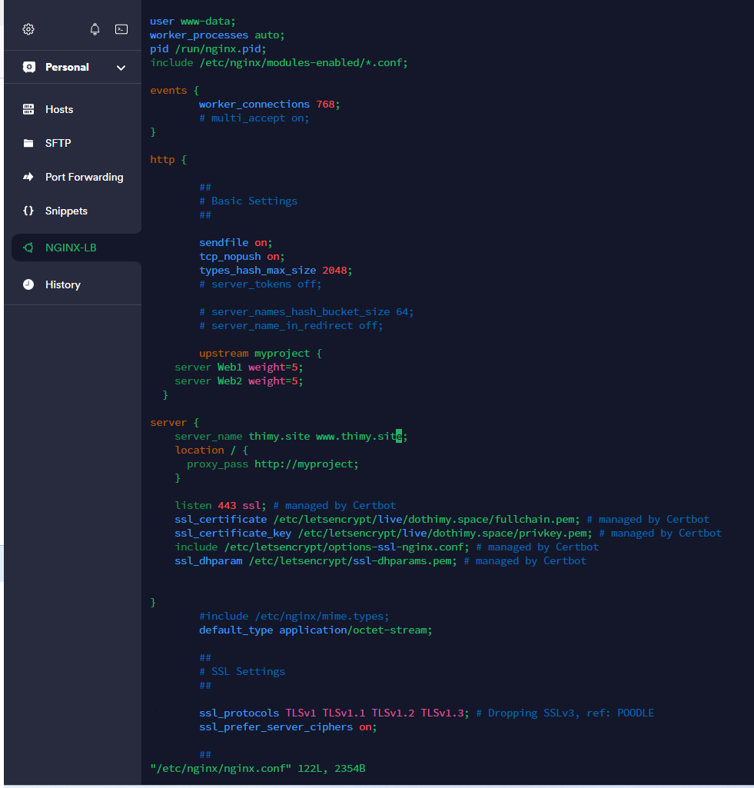
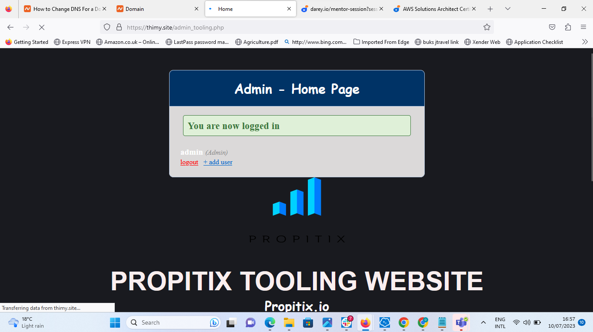
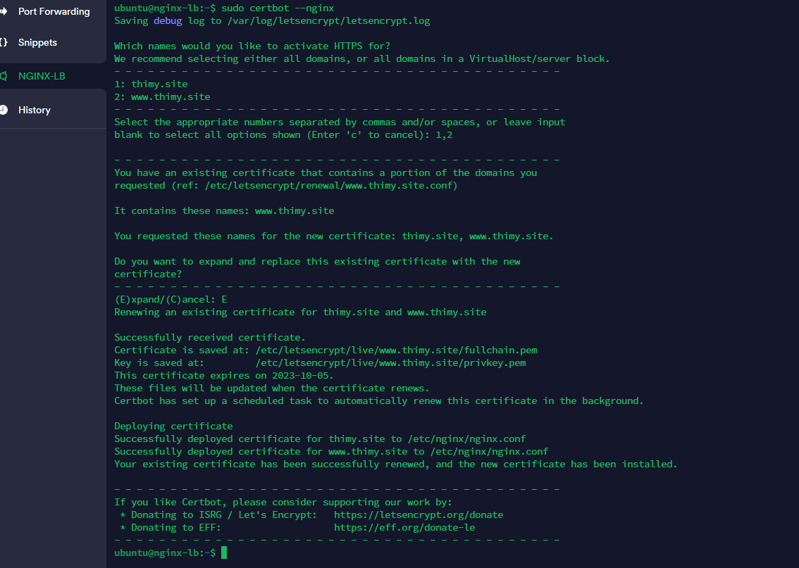
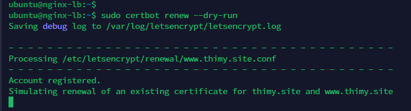

## **Documentation for Project 10**

### Updating etc Hostfile

### Configuring Nginx as Load Balancer

`sudo apt update`
`sudo apt install nginx`

### Ensuring nginx is up and running

`sudo systemctl restart nginx`
`sudo systemctl status nginx`

## **Configuring Route 53**

### creating hosted zone

### Name server Configuration

### Configuring NginxLB with Webserver Names defined in etc Hostfile

`sudo vi /etc/nginx/nginx.conf`

### Removing default site to allow reverse proxy to redirect to our new config file and testing to ensure our Nginx config is okay

`sudo rm -f /etc/nginx/sites-enabled/default`

`sudo nginx -t`

### Linking our LB config file in site-available to site-enables to allow Nginx access our Config

`sudo ln -s ../sites-available/load_balancer.conf .`

### Accessing our newly registered Domian from URL

`http://thimy.site/`

## Securing our Domain

### Installing Certbot and its dependencies

`sudo apt install certbot -y`
`sudo apt install python3-certbot-nginx -y`

### Creating a certificate for our Domain to make it secure

`sudo certbot --nginx -d thimy.site -d www.thimy.site`

